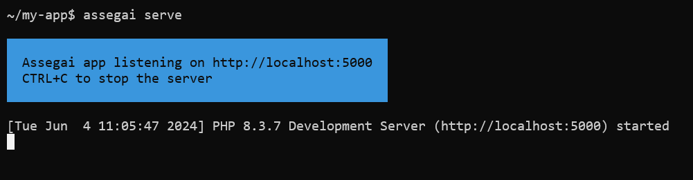

<div align="center">
    <a href="https://assegaiphp.com/" target="blank"></a>
</div>

# Assegai Console

## Requirements
- PHP 8.2 (minimum)
- Composer 2.x.x

## Description

The AssegaiPHP Console is a command-line interface tool that makes it easy to create, develop, and maintain Assegai applications. It provides various features, such as creating a new project, running the application in development mode, and building and packaging it for production deployment.

The AssegaiPHP Console includes built-in support for the collection of [schematics] available at @assegaiphp/schematics, allowing for easy initialization, development, and maintenance of AssegaiPHP applications through scaffolding, development mode serving, and production distribution building and bundling.

## Installation

### Linux

Install the Assegai Console globally using Composer:
```bash
$ composer global require assegaiphp/console
```

Add the Composer bin directory to your PATH to make the `assegai` command available globally:
```bash
$ ln -s ~/.config/composer/vendor/bin/assegai /usr/local/bin/assegai
```

### Windows

> **Note:** The following instructions are for Windows 10/11. If you are using an older version of Windows, please refer to the [official Composer documentation](https://getcomposer.org/doc/00-intro.md#installation-windows) for installation instructions.

For Windows, you can use WSL (Windows Subsystem for Linux) to install the Assegai Console. Follow the instructions for [Linux](#linux) above.

### macOS

For macOS, you can use the same instructions as for [Linux](#linux).

## Usage

### Get Started

To create a new Assegai project, run the following command:
```bash
$ assegai new my-app
```

This command will create a new Assegai project in the `my-app` directory.

### Development

After creating a new project, you can start the development server to preview your application in the browser.
```bash
$ cd my-app
```

To start the development server, navigate to the project directory and run the following command:
```bash
$ assegai serve
```



Learn more in the [official documentation](https://assegaiphp.com/guide/cli/overview).

## Stay in touch

* Author - [Andrew Masiye](https://twitter.com/feenix11), [Daniel Kaluba](https://twitter.com/ZombieKlassic)
* Website - [https://atatusoft.com](https://atatusoft.com/)
* X - [@assegaiphp](https://twitter.com/assegaiphp)

## License

Assegai Console is [MIT Licensed](LICENSE)

[schematics]: https://github.com/angular/angular-cli/tree/master/packages/angular_devkit/schematics