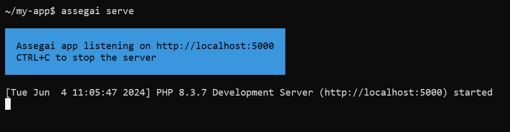

<div align="center">
    <a href="https://assegaiphp.com/" target="blank"></a>
</div>

# Assegai Console

## Requirements
- PHP 8.2 (minimum)
- Composer 2.x.x

## Description

The Assegai Console is the framework CLI for:

- creating new projects
- serving apps locally
- generating framework features
- exporting API contracts and clients
- working with queues, migrations, databases, and Web Components

It also supports custom schematics so teams can teach `assegai generate` about their own company-specific features.

## Installation

### Linux

Install the Assegai Console globally using Composer:
```bash
$ composer global require assegaiphp/console
```

Create a symbolic link to the Assegai Console binary in a directory that is included in your system's `PATH` environment variable. For example, you can create a symbolic link in the `/usr/local/bin` directory:
```bash
$ sudo ln -s ~/.config/composer/vendor/bin/assegai /usr/local/bin/assegai
```

Alternatively, you can add the [Composer](https://getcomposer.org/doc/00-intro.md#installation-linux-unix-macos) bin directory to your `$PATH` to make `assegai` 
available globally. To do so, add the following line to your shell configuration file (e.g., `~/.bashrc`, `~/.zshrc`, 
etc.):

```bash
$ export PATH="$PATH:$HOME/.config/composer/vendor/bin"
```

> **Note:** The path to the Composer bin directory may vary depending on your system configuration. Please refer to the [official Composer documentation](https://getcomposer.org/doc/00-intro.md#installation-linux-unix-macos) for more information.

### Windows

> **Note:** The following instructions are for Windows 10/11. If you are using an older version of Windows, please refer to the [official Composer documentation](https://getcomposer.org/doc/00-intro.md#installation-windows) for installation instructions.

For Windows, you can use WSL (Windows Subsystem for Linux) to install the Assegai Console. Follow the instructions for [Linux](#linux) above.

### macOS

For macOS, you can use the same instructions as for [Linux](#linux).

## Usage

### Get Started

To create a new Assegai project, run the following command:
```bash
$ assegai new my-app
```

This command will create a new Assegai project in the `my-app` directory.

### Development

After creating a new project, you can start the development server to preview your application in the browser.
```bash
$ cd my-app
```

To start the development server, navigate to the project directory and run the following command:
```bash
$ assegai serve
```



## Custom schematics

You can extend the generator without forking the CLI.

The default local convention is:

```text
schematics/<name>/
  schematic.json
  templates/
```

Start with a declarative starter:

```bash
assegai schematic:init loyalty-program
```

Or scaffold a PHP-backed starter when generation needs real logic:

```bash
assegai schematic:init customer-portal --php
```

Inspect what the CLI discovered:

```bash
assegai schematic:list
```

Run a custom schematic through the normal generate workflow:

```bash
assegai g loyalty-program rewards
```

For reusable team schematics, package manifests can be exposed through `composer.json`:

```json
{
  "extra": {
    "assegai": {
      "schematics": [
        "resources/loyalty/schematic.json"
      ]
    }
  }
}
```

Learn more in the [official documentation](https://assegaiphp.com/guide/getting-started/custom-cli-schematics).

## Stay in touch

* Author - [Andrew Masiye](https://twitter.com/feenix11), [Daniel Kaluba](https://twitter.com/ZombieKlassic)
* Website - [https://atatusoft.com](https://atatusoft.com/)
* X - [@assegaiphp](https://twitter.com/assegaiphp)

## License

Assegai Console is [MIT Licensed](LICENSE)

[schematics]: https://github.com/angular/angular-cli/tree/master/packages/angular_devkit/schematics
