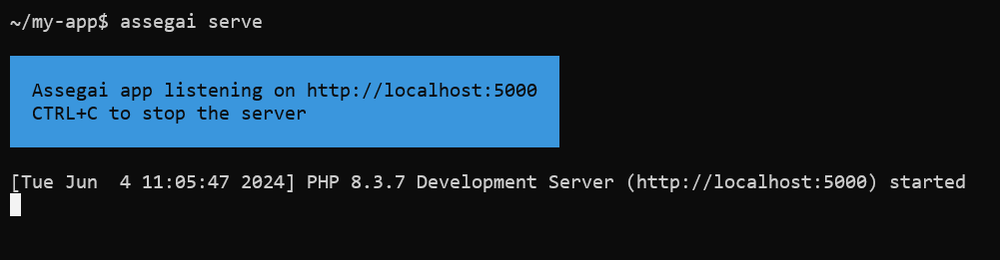

<div align="center">
    <a href="https://assegaiphp.com/" target="blank"></a>
</div>

<p align="center">
  <a href="https://github.com/assegaiphp/console/releases"></a>
  <a href="https://github.com/assegaiphp/console/actions/workflows/php.yml"></a>
  
  <a href="https://github.com/assegaiphp/console/blob/main/LICENSE"></a>
  
</p>

# Assegai Console

## Requirements
- PHP 8.4 (minimum)
- Composer 2.x.x

## Description

The Assegai Console is the framework CLI for:

- creating new projects
- serving apps locally
- generating framework features
- exporting API contracts and clients
- working with queues, migrations, databases, and Web Components
- upgrading existing workspaces across supported framework release lines

It also supports custom schematics so teams can teach `assegai generate` about their own company-specific features.

## Contribution workflow

For commit and pull request conventions in this repo, see:

- [docs/commit-and-pr-guidelines.md](./docs/commit-and-pr-guidelines.md)


## Installation

Install the Assegai Console globally using Composer:

```bash
$ composer global require assegaiphp/console
```

Then make sure Composer's global bin directory is on your `PATH`:

```bash
$ composer global config bin-dir --absolute
```

If the printed directory is not already on your `PATH`, add it in your shell profile. For example:

```bash
$ export PATH="$PATH:$(composer global config bin-dir --absolute)"
```

Refer to the [official Composer documentation](https://getcomposer.org/doc/00-intro.md) if your global Composer home is configured differently.

### Keeping the CLI current

Update an existing global installation through the CLI itself:

```bash
$ assegai global update
# shorthand
$ assegai -g update
```

Normal commands perform a cached, short-timeout check for stable Console releases. When a newer version exists, the notice is written to stderr so command stdout remains safe for scripts and structured output. A successful check is reused for 24 hours, a failed check is retried after one hour, and an unavailable version service never prevents the requested command from running. Set `ASSEGAI_NO_UPDATE_CHECK=1` when automatic checks must be disabled in a controlled environment.

The self-updater first ships with Console 0.10.1. It cannot be retrofitted into an older binary that is already installed. A release rollout that promises a fully self-service migration from an earlier Console must distribute an updater-enabled bridge or managed installer before asking those users to run this command.

## Usage

### Get Started

To create a new Assegai project, run the following command:
```bash
$ assegai new my-app
```

This command will create a new Assegai project in the `my-app` directory.

The scaffold flow can also:

- initialize git
- configure a database
- write sensitive config to `config/secure.php`
- set up a starter users resource when ORM is enabled

### Cloned projects and application keys

Keep `.env.example` in Git with placeholder values; each environment owns its ignored `.env` file. After cloning a project, run:

```bash
composer install
assegai key:generate
```

`key:generate` creates a missing `.env` from `.env.example` and initializes `APP_SECRET_KEY` with 32 cryptographically random bytes encoded as 64 hexadecimal characters. It also works before installing project dependencies. If neither file exists, create `.env` first. Other settings and the example file are preserved, and the key is never printed.

To rotate an existing key, run `assegai key:generate` and confirm, or explicitly use `assegai key:generate --force` in automation. `--directory` (`-d`) selects another workspace. Existing non-placeholder keys are never replaced without approval. Rotation may invalidate tokens or encrypted data that use the old key; retain the old key where needed and restart long-running application processes. All instances of the same environment must share the same key. Do not regenerate it on every install, update, or deployment.

`assegai new` generates the initial key automatically. The key command updates the local `.env` file; deployments that inject `APP_SECRET_KEY` through the process environment or a secret manager must update that value there.

### Development

After creating a new project, you can start the development server to preview your application in the browser.
```bash
$ cd my-app
```

To start the development server, navigate to the project directory and run the following command:
```bash
$ assegai serve
```



### OpenSwoole runtime

If you want to try the long-lived runtime path instead of the default PHP development server, install the OpenSwoole extension first and then run:

```bash
$ assegai serve --runtime=openswoole
```

You can also persist that choice in `assegai.json`:

```json
{
  "development": {
    "server": {
      "runtime": "openswoole",
      "host": "127.0.0.1",
      "port": 9510,
      "openswoole": {
        "workerNum": 1,
        "taskWorkerNum": 0,
        "maxRequest": 0,
        "enableCoroutine": true,
        "hookFlags": "all"
      }
    }
  }
}
```

If the extension is not installed, the CLI now stops early with a direct setup message instead of falling into a runtime bootstrap failure.

The current OpenSwoole path is still experimental. It is intended for careful testing and advanced runtime work, not as a blanket replacement for the default `php` runtime in every project.

## Upgrading existing projects

The Console release determines the framework release line that `assegai update` can select. Composer constraints such as `^0.9.0` deliberately exclude 0.10, so update the globally installed CLI before asking it to migrate a 0.9 project:

```bash
$ assegai global update
# or: assegai -g update
$ assegai --version
$ assegai update --to=0.10 --dry-run
$ assegai update --to=0.10
```

The dry run lists every direct requirement change and the Composer update set without changing files. A cross-release update then requires confirmation; non-interactive environments must pass `--yes` explicitly.

If the project itself requires `assegaiphp/console:^0.9`, do not try to upgrade that local dependency by itself. Run the globally installed 0.10 CLI so Core, the local Console requirement, and the other coordinated first-party packages move to 0.10 in one Composer transaction.

The command hydrates `assegai.json`, updates `composer.json`, and runs Composer with all dependent packages. It does not rewrite application PHP source or create `config/auth.php`. Review the [update advisor](https://update.assegaiphp.com/) for the application-owned configuration and verification steps. If Composer fails, the CLI restores `assegai.json`, `composer.json`, and `composer.lock`; run `composer install` if Composer changed `vendor/` before failing.

## Generating code

Use `assegai generate` (or `assegai g`) to scaffold framework artifacts:

```bash
$ assegai g resource users
$ assegai g component app --flat
$ assegai g page dashboard --path src/Admin
```

Useful options include:

- `--flat` to generate directly into the target path instead of creating a name-based subdirectory
- `--path` to place generated files at a source-relative path

Database-aware commands also support MySQL, MariaDB, PostgreSQL, SQLite, and MSSQL where applicable.

## Custom schematics

You can extend the generator without forking the CLI.

The default local convention is:

```text
schematics/<name>/
  schematic.json
  templates/
```

Start with a declarative starter:

```bash
assegai schematic:init loyalty-program
```

Or scaffold a PHP-backed starter when generation needs real logic:

```bash
assegai schematic:init customer-portal --php
```

Inspect what the CLI discovered:

```bash
assegai schematic:list
```

Run a custom schematic through the normal generate workflow:

```bash
assegai g loyalty-program rewards
```

For reusable team schematics, package manifests can be exposed through `composer.json`:

```json
{
  "extra": {
    "assegai": {
      "schematics": [
        "resources/loyalty/schematic.json"
      ]
    }
  }
}
```

Learn more in the [official documentation](https://assegaiphp.com/guide/getting-started/custom-cli-schematics).

## Stay in touch

* Author - [Andrew Masiye](https://twitter.com/feenix11), [Daniel Kaluba](https://twitter.com/ZombieKlassic)
* Website - [https://assegaiphp.com](https://assegaiphp.com/)
* X - [@assegaiphp](https://twitter.com/assegaiphp)

## License

Assegai Console is [MIT Licensed](LICENSE)

[schematics]: https://github.com/angular/angular-cli/tree/master/packages/angular_devkit/schematics
